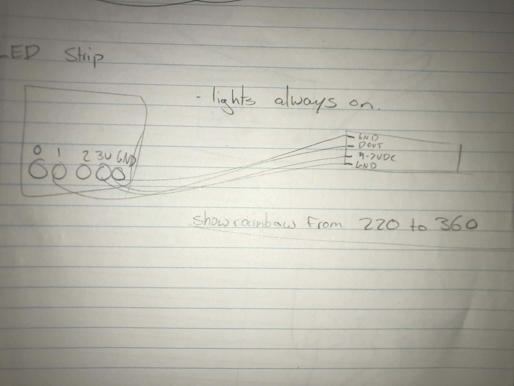

# 1701QCA Final project journal: Roise Bailey

<!--- As for other assessments, fill out the following journal sections with information relevant to your project. --->

<!--- Markdown reference: https://guides.github.com/features/mastering-markdown/ --->

## Related projects ##
<!--- Find about 6 related projects to the project you choose. A project might be related through  function, technology, materials, fabrication, concept, or code. Don't forget to place an image of the related project in the appropriate folder and insert the filename in the appropriate places below. Copy the markdown block of code below for each project you are showing. --->

### Related project 1 ###
Motion Activated Halloween Spider

https://www.instructables.com/id/Motion-Activated-Halloween-Spider/

This project is related to mine with the similar use of technology and concept of using a moving spider to scare a person. The spider is controlled using micro controller technology and is powered by a motor, similar to my project.

### Related project 2 ###
Spider Marionette

https://blog.makeitfuncrafts.com/2016/10/22/spider-marionette/

This project is related to mine due to the same concept of using a spider and marionette technology to control the movement of it. There will also be similarities in the materials used to build the actual spider, though ideally my spider will look more professional.

### Related project 3 ###
Servo Motor String Acceleration

https://www.youtube.com/watch?v=C1SBujD_awo

This project is related to mine due to the technology (a servo motor) being used to raise and lower a weighted string. The technology behind this project can be altered to be useful in my mobile, this is something that I will attempt before the final project is due.

### Related project 4 ###
Arduino super mario brothers room greeter

https://www.youtube.com/watch?v=cofqYukXTow&feature=emb_title

This project is related to mine with the use of similar technology, and concept. A PIR Motion Sensor is used to monitor movement in a room, setting off a buzzer when movement is detected. The project is also powered by Arduino which is similar technology to the micro:bit.

### Related project 5 ###
Motorized Marionette Puppet

https://www.researchgate.net/figure/The-motorized-marionette-and-its-model-The-marionette-is-about-60cm-tall-The-shoulder_fig1_4041647

This project is related to mine through similar technology and concept being a puppet like shape with limbs being controlled using a motor. Though this project is more advanced than mine will be, the idea and base technology behind it is of a similar nature to what mine will be.

### Related project 6 ###
Motion and Sound Activated Baby Mobile

https://www.littlebits.cc/projects/sound-motion-activated-baby-mobile

This project is related to mine through similar concept being a mobile that is activated through motion. While this mabile is made specifically for a baby, my mobile has multiple uses such as a halloween decoration.

## Other research ##
<!--- Include here any other relevant research you have done. This might include identifying readings, tutorials, videos, technical documents, or other resources that have been helpful. For each particular source, add a comment or two about why it is relevant or what you have taken from it. You should include a reference or link to each of these resources. --->
### Attatching a PIR Motion Sensor to a micro:bit ###

https://www.teachwithict.com/pir.html

This source provided a tutorial on how to attach a PIR motion sensor to the micro:bit.

### Connecting a Servo Motor to a micro:bit ###

https://www.kitronik.co.uk/blog/using-bbc-microbit-control-servo/

This source demonstrated how to connect a servo motor to the micro:bit.

### Marionette: From Traditional Manipulation to Robotic Manipulation ###

https://link.springer.com/chapter/10.1007%2F1-4020-2204-2_10

This source is focused on the evolution of the manipulation of marionette puppets. This was useful to the development of my project by helping me form an understanding of the function of a marionette and how I can replicate this technology in my project.

## Conceptual development ##

### Design intent ###
A motor driven mobile that moves under certain conditions.

### Design ideation ###
<!--- Document your ideation process. This will include the design concepts presented for assessment 2. You can copy and paste that information here. --->
### Design concept 1 ###

Micro:bit baby mobile where the base spins and individual strings move up and down as the motor spins.

Pros
- Able to include various micro:bit functions such as the use of a motor, light sensor, LED lights and possible various other elements.

Cons
- Similar to products that already exist, will end up making an inferior inversion.
- Need to purchase additional parts such as a motor.

### Design concept 2 ###
A mobile shaped device that you can install under a lamp shade were a motion sensor will detect a persons hand going in to turn on the light, lowering spiders using a motor.

Pros
- The concept will be achievable to finish by the end of the course.
- Won't be too hard to build the mini spiders.

Cons
- Difficult it neatly build the mobile under a lamp shade.
- Simple technology- not challenging enough.

### Design concept 3 ###
A mobile of a single spider where when the motion sensor senses movement, the motor turns, pulling individial strings that move the spiders legs while playing a song.

Pros
- Construction of the project is achievable with elements that are still challenging.
- Sticks to the design intent of a motor controlled mobile, while adding in the idea of using it as a halloween decoration.
- Room to improve and add elements

Cons
- Need to purchase additional parts (Servo Motor and PIR Motion Sensor).
- Will be difficult to get the final project to look professional.

### Final design concept ###
<!--- This should be a description of your concept including its context, motivation, or other relevant information you used to decide on this concept. --->
A small scene where when it detects motion, spiders start spinning and moving up and down with led's also activated.

### Interaction flowchart ###
<!--- Include an interaction flowchart of the interaction process in your project. Make sure you think about all the stages of interaction step-by-step. Also make sure that you consider actions a user might take that aren't what you intend in an ideal use case. Insert an image of it below. It might just be a photo of a hand-drawn sketch, not a carefully drawn digital diagram. It just needs to be legible. --->

## Process documentation ##
<!--- In this section, include text and images (and potentially links to video) that represent the development of your project including sources you've found (URLs and written references), choices you've made, sketches you've done, iterations completed, materials you've investigated, and code samples. Use the markdown reference for help in formatting the material.

This should have quite a lot of information! It will likely include most of the process documentation from assessment 2 which can be copied and pasted here.

Use subheadings to structure this information. See https://guides.github.com/features/mastering-markdown/ for details of how to insert subheadings.

There will likely by a dozen or so images of the project under construction. The images should help explain why you've made the choices you've made as well as what you have done. --->

Initial test of the motor included in the Kitronik Inventor's Kit to see if the motor was strong enough to support and move a string. This attempt was unsuccessful- leading to the purchase of the servo motor.

####Video of test:####

https://www.youtube.com/watch?v=Oh5N0yDEmcg&feature=youtu.be 

####Testing the PIR Motion Sensor####

The tests of the PIR Motion Sensor were unsuccessful, most likely due to a lack of power. This is something that will have to be improved before the final project.

####Testing the servo motor####

Testing the servo motor with additional weight

Testing the motor and button to move one string

Testing the motor with multiple strings connected to one object

####Video of servo motor tests:####

https://www.youtube.com/watch?v=ZHziciWTWhk&feature=youtu.be

The decision was made to use the servo to control one small spider and add gears to spin two other spiders using another motor.
The addition of a light strip was also added.

####Testing the servo motor to move up and down####

VIDEO

####Testing the light strip####

####Testing the motor####

####Testing the sensor####
The decision was made to switch fron thr PIR Motion Sensor to a Ultrasonic Distance sensor as it seemed best fit for this project.

VIDEOS

####Testing the sensor and the light together####

####Soldering wires####

####Construction of the project####
The construction concept of the project was altered to be set in a small garden diagram. This choice was made to help hide extra wires, battery packs and allow for the servo spider to hang down.

#####Constructing spiders#####

#####Constructing the tree#####

#####Building the gear controlled spiders#####

#####Installing the servo motor into the tree#####

#####Placing spiders into diagram#####

#####Adding grass#####

#####Placing all wires underneath the project#####

#####Installing lights and sensor#####

####Final Test####
VIDEO

## Final code ##

<!--- Include here screenshots of the final code you used in the project if it is done with block coding. If you have used javascript, micropython, C, or other code, include it as text formatted as code using a series of three backticks ` before and after the code block. See https://guides.github.com/features/mastering-markdown/ for more information about that formatting. --->

## Design process discussion ##
<!--- Discuss your process used in this project, particularly with reference to aspects of the Double Diamond design methodology or other relevant design process. --->

## Reflection ##

<!--- Describe the parts of your project you felt were most successful and the parts that could have done with improvement, whether in terms of outcome, process, or understanding.

What techniques, approaches, skills, or information did you find useful from other sources (such as the related projects you identified earlier)?

What parts of your project do you feel are novel? This is IMPORTANT to help justify a key component of the assessment rubric.

What might be an interesting extension of this project? In what other contexts might this project be used? --->
